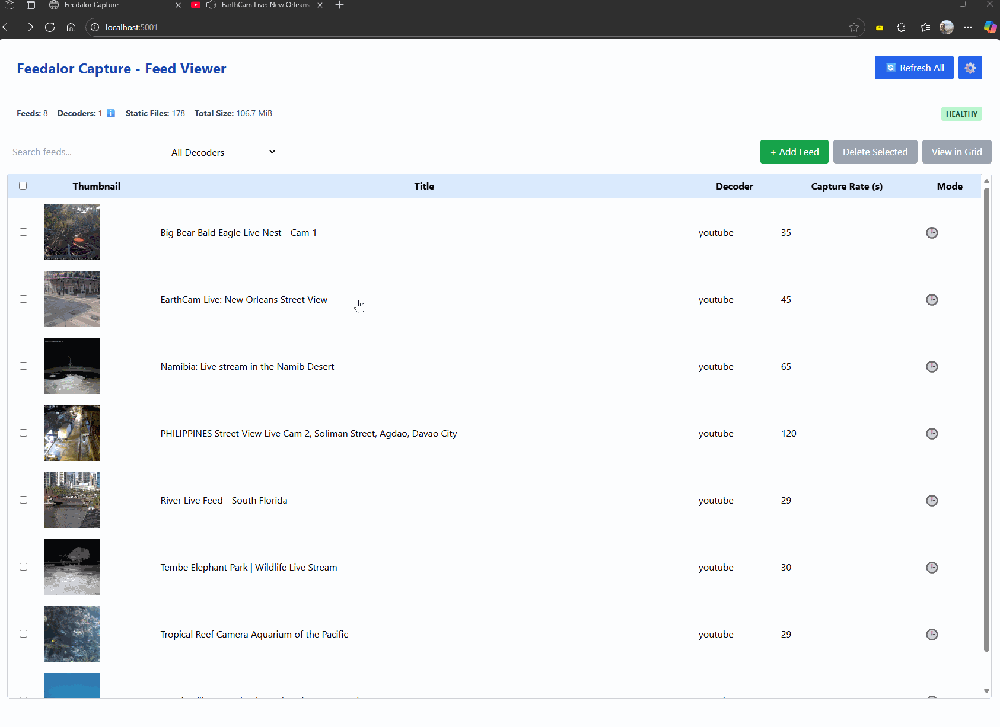
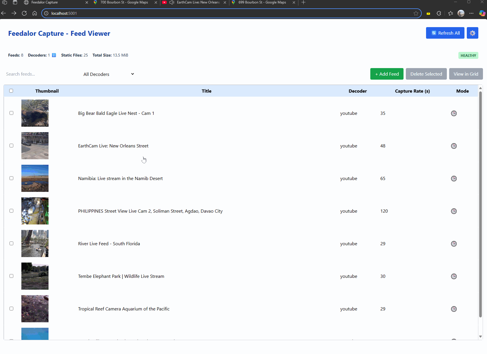
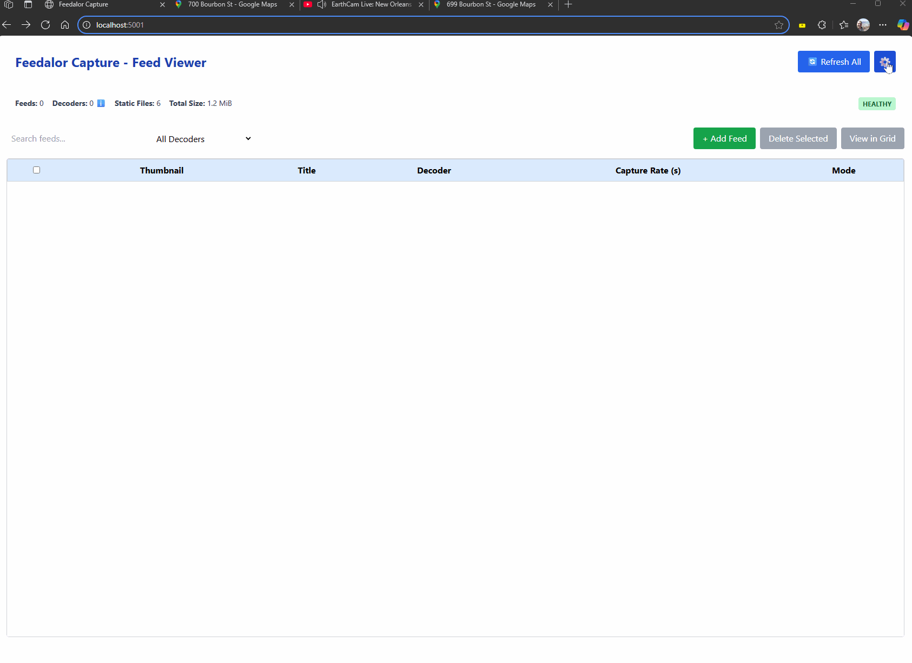

# Feedalor Capture: User Workflows

This document provides step-by-step instructions for common user tasks in Feedalor Capture. Each section is accompanied by an animated illustration or screenshot.

---

## 1. Add a New Feed

**Steps:**

1. Click the **"+ Add Feed"** button.
2. Enter a **title** and **stream URL**.
3. Select a **decoder** from the dropdown.
4. Choose a **capture mode**:
    - Interval: specify seconds between frames
    - Schedule: enter one or more UTC times
5. Optionally add a **crop region** or GPS metadata.
6. Click **Save**.

**Illustration:**  

---

## 2. Edit an Existing Feed

**Steps:**

1. Click the **edit icon** in the feed row.
2. Modify the desired fields:
    - Title, URL, decoder, schedule, GPS, etc.
3. Click **Save**.  ChangeParameters

**Illustration:**  

---

## 3. Delete One or More Feeds

**Steps:**

1. Check the boxes beside the feeds you want to delete.
2. Click **"Delete Selected"**.
3. Confirm the deletion.

**Illustration:**  

---

## 4. View Feeds in Grid

**Steps:**

- To view all feeds:  
  Go to `/standard_grid`

- To view selected feeds:
    1. Select feeds using checkboxes.
    2. Click **"View in Grid"**.
    3. A new grid view will open with only those feeds.

**Illustration:**  

---

## 5. Navigate Feed Viewer

**Steps:**

1. Click a feed's title to open the viewer.
2. Use the **slider** to scroll through frame history.
3. Hover to view the capture timestamp.
4. Review crop overlays or metadata as needed.

**Illustration:**  

---

## 6. Export and Restore Feed Configuration

### Export:
1. Visit `/engineering`
2. Click **"Backup Feeds"**
3. A `.json` file will download   

**Illustration:**  

### Restore:
1. Visit `/engineering`
2. Click **"Restore Feeds"**
3. Select your `.json` file
4. Click **Upload**

**Illustration:**  

---

## 7. View Application Log

**Steps:**

1. Go to `/engineering`
2. Click **"View Application Log"**
3. Scroll to browse logs
4. Click **Pause Updates** if needed

**Illustration:**  
_Insert GIF: view_log.gif_

---

## 8. Toggle Column Visibility in Engineering Table

**Steps:**

1. Go to `/engineering`
2. Use the checkboxes above the feed table
3. Columns will hide or reappear
4. Preferences are saved locally in your browser

**Illustration:**  
_Insert GIF: toggle_columns.gif_

---

## Notes

- All times are in **UTC**
- Use **Chrome or Firefox** for best results
- Crop, schedule, and decoder options may vary by feed type

---

