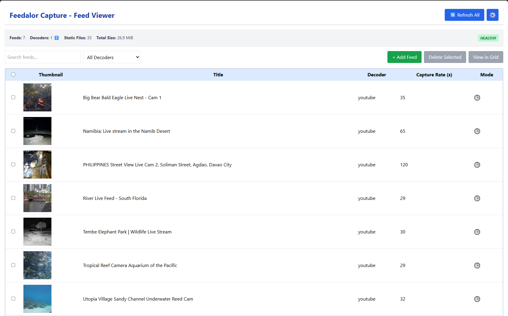

# Feedalor Capture - Universal Visual Capture Engine



A modern, extensible platform for capturing still frames from any dynamic visual source. Originally designed for CCTV feeds, this open-source tool has evolved into a general-purpose **visual probe engine** — perfect for freezing moments from live streams, APIs, dashboards, sensors, and more.

---

## Features

- Capture from MJPEG streams, webcams, YouTube Live, sensor APIs, and beyond
- User selectable 
- Grid view with user-selcted feeds
- Modular plugin-based decoder system ([see decoder guide](docs/dev_guide_plugins.md))
- Region cropping 
- Backup and restore feed metadata with JSON
- Engineering view and admin Settings modal
- Personal use — no login/auth required
- Fully Dockerized, easy to deploy

---

## Getting Started

### Prerequisites
- Docker
- Docker Compose

### Quick Start
```bash
git clone https://github.com/TimWoodburn/Feedalor_Capture
cd Feedalor_Capture
```
review and rename .env.example to .env
review and rename .env.keys.example to .env.keys

```bash
docker compose build
docker compose up
```

Then open `http://localhost:5001` in your browser.

Add your own feeds or load "Example_Feed_Set" via the settings menu, top right. Note, the example feeds may not be live.

---

## Decoder Philosophy: Visual Probes

> **A Decoder is a visual probe.**

Its job is to reach into *any dynamic source* — stream, web page, API, sensor, social media — and return a **still image** representing the current state of that external world.

This goes beyond security cams:

| Source Type             | Decoder Action                         |
|------------------------|----------------------------------------|
| MJPEG stream           | Grab current frame                     |
| Single JPEG URL        | Fetch image                            |
| YouTube Live           | Screenshot the stream                  |
| Web page               | Snapshot entire page                   |


| Ideas For Future Decoder | Decoder Action                         |
|------------------------|----------------------------------------|
| Sensor API             | Render graph as image                  |
| Social media profile   | Visual diff / profile screenshot       |
| Weather radar          | Latest radar map image                 |

This is part of a broader **mission**:

> **Poll anything that changes visually over time** and store **lightweight frozen moments** — without recording video.

[Read more about this in the decoder philosophy document →](docs/decoder_philosophy_and_future.md)

---

## Tech Stack

- **Frontend**: React + Tailwind CSS
- **Backend**: Flask + SQLite
- **Task Queue**: RQ
- **Image Processing**: PIL, OpenCV
- **Containerization**: Docker

---


## Folder Structure

```text
.
├── backend/               # Flask API + Decoders
├── frontend/              # React interface
├── docs/                  # Developer & API docs
│   ├── api_docs.md
│   ├── decoder_philosophy_and_future.md
│   └── dev_guide_plugins.md
├── .env.example           # Example environment file
├── docker-compose.yml
├── README.md              # You're here
```

---

## 🔌 Decoders: Plug and Probe

Each decoder plugin must implement a minimal interface:

- `fetch_frame()` ➜ returns a PIL Image or raw JPEG
- Can access any URL, API, camera device, or service

See the [Plugin Developer Guide](docs/dev_guide_plugins.md) for full interface, examples, and tips.

This modular system means you can:
- Monitor web dashboards
- Visualize changing data
- Integrate custom graphing logic
- Adapt to sensors or Raspberry Pi cams

---


## Backup / Restore

Use the ⚙ **Settings Modal** to:

- Backup ➜ Download `CCTV_FEEDS_BACKUP_<timestamp>.json`
- Restore ➜ Upload saved JSON config

---

## License

This project is licensed under the [MIT License](LICENSE).

---

## Contributing

Pull requests are welcome! For new decoders, [see the plugin guide](docs/dev_guide_plugins.md). API reference is available in [docs/api_docs.md](docs/api_docs.md). Ideas and feedback welcome via GitHub Issues.

---

## Author

Maintained by [Tim Woodburn / TimWoodburn]

> “Built to explore the edges of simple, universal visual capture.”
